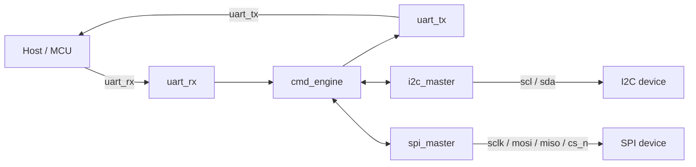

# UART-to-I2C/SPI Bridge ASIC

An open-source digital ASIC that receives framed commands over UART and,
depending on the command, drives an I2C or SPI peripheral bus. It is
built entirely with open tooling: RTL in Verilog, verification with
[cocotb](https://www.cocotb.org/), and physical implementation on the
[sky130](https://skywater-pdk.readthedocs.io/) open PDK via
[LibreLane](https://librelane.readthedocs.io/).

The goal of this project is to be a complete, reviewable example of the
open-silicon flow end to end: a hand-designed communication protocol, RTL
for three small controllers (UART, I2C, SPI) and the state machine that
ties them together, a cocotb testbench with hand-rolled I2C/SPI bus
models, and a LibreLane configuration that carries the design through
synthesis, place-and-route, and GDSII.

## Why a UART-to-I2C/SPI bridge

I2C and SPI are the two buses almost every sensor, EEPROM, ADC, or
display speaks, but a host PC has neither natively - it has a UART (real
or over USB). This chip is a small, standalone protocol translator: send
it a byte-framed command over UART, and it performs the corresponding
I2C or SPI transaction and reports the result back. That makes it useful
on its own (a USB-to-I2C/SPI dongle, effectively) and a reasonably
compact design to read start to finish.

## Interface design

The core of this project is the UART command protocol - see
[`docs/PROTOCOL.md`](docs/PROTOCOL.md) for the full specification.
Summary:

Host to device: `| OPCODE (1B) | LEN (1B) | PAYLOAD (LEN bytes) | CHECKSUM (1B) |`

Device to host: `| STATUS (1B) | RLEN (1B) | RDATA (RLEN bytes) | CHECKSUM (1B) |`

| Opcode | Name | What it does |
|---|---|---|
| `0x01` | `PING` | Liveness check, responds `ACK` |
| `0x02` | `GET_ID` | Returns a version/device-ID byte pair |
| `0x10` | `I2C_WRITE` | START, address (R/W=0), N data bytes, STOP |
| `0x11` | `I2C_READ` | START, address (R/W=1), N data bytes (ACKed except the last), STOP |
| `0x12` | `I2C_WRITE_READ` | Write phase, repeated START, read phase, STOP (register-pointer idiom) |
| `0x20` | `SPI_XFER` | Full-duplex transfer of N bytes with CS held across the burst |
| `0x30` | `SET_CONFIG` | Runtime-configure I2C/SPI clock dividers, SPI mode, CS polarity |
| `0x31` | `GET_STATUS` | Returns the status of the previous command |

A Python host driver implementing this protocol lives in
[`python/`](python/README.md).

## Architecture



See [`docs/architecture.md`](docs/architecture.md) for a per-module
description and the internal state-machine structure of `cmd_engine`.

## Pinout

### Standalone/native core (`uart_iic_spi_bridge`)

| Pin | Dir | Description |
|---|---|---|
| `clk` | in | system clock |
| `rst_n` | in | async active-low reset |
| `uart_rx` | in | UART command input |
| `uart_tx` | out | UART response output |
| `spi_sclk` | out | SPI clock |
| `spi_mosi` | out | SPI data out |
| `spi_miso` | in | SPI data in |
| `spi_cs_n[1:0]` | out | 2 SPI chip-selects |
| `i2c_scl_out` / `i2c_scl_oe` / `i2c_scl_in` | out / out / in | split open-drain SCL |
| `i2c_sda_out` / `i2c_sda_oe` / `i2c_sda_in` | out / out / in | split open-drain SDA |
| `busy` | out | command engine active |
| `error` | out | last command ended in error |

I2C uses explicit `_out`/`_oe`/`_in` triplets instead of a Verilog
`inout`, since real pad tri-state control belongs to the pad ring (or,
on TinyTapeout, the shared `uio` pins), not the digital core.

### TinyTapeout wrapper (`tt_um_uart_iic_spi_bridge`)

A thin, logic-free wrapper (`rtl/tt_um_uart_iic_spi_bridge.v`) maps the
native pinout onto the [TinyTapeout](https://tinytapeout.com) harness
pins - see [`docs/architecture.md`](docs/architecture.md#tinytapeout-pin-mapping)
for the full table. Because every core port is wired straight to a real
top-level pin in *both* variants, nothing is ever left dangling, so
synthesis has no dead logic to prune in either flow.

## Repository layout

```
uart_iic_spi_asic/
├── rtl/                         Verilog source (UART, I2C, SPI, protocol engine, tops)
├── tb/cocotb/                   cocotb testbenches + hand-rolled I2C/SPI bus models
├── flow/standalone/             LibreLane config for the native pinout
├── flow/tinytapeout/            LibreLane config for the TinyTapeout wrapper
├── docs/PROTOCOL.md             Full UART command protocol specification
├── docs/architecture.md         Module-by-module architecture notes
├── python/                      Python host driver (pip install -e python/)
└── scripts/setup_cocotb_venv.sh Creates the Python venv for cocotb
```

## Getting started

This project targets the [LibreLane](https://librelane.readthedocs.io/)
nix-shell environment (see LibreLane's
[installation guide](https://librelane.readthedocs.io/en/latest/getting_started/installation/index.html)
if you don't have it set up):

```console
$ nix-shell ~/librelane/shell.nix
```

All commands below assume you're inside that shell.

### Run the RTL sanity check

```console
[nix-shell]$ make lint
```

### Run the cocotb testbench

```console
[nix-shell]$ make sim-setup   # once: creates .venv and installs cocotb
[nix-shell]$ make sim
```

This runs 21 tests: unit tests for `uart_rx`/`uart_tx` (loopback byte
decode, framing-error detection), `i2c_master` (write/read/repeated-START
against a hand-rolled I2C slave model, address NACK handling), and
`spi_master` (all four CPOL/CPHA modes, multi-byte bursts, CS polarity),
plus a full-stack integration test that drives `uart_iic_spi_bridge`
with real bit-banged UART frames and checks every opcode end to end,
including the checksum/length/opcode error paths.

### Run the LibreLane flow

```console
[nix-shell]$ make flow-standalone     # native pinout -> GDSII
[nix-shell]$ make flow-tinytapeout    # TinyTapeout wrapper -> GDSII
```

Or just synthesis, to check the design maps cleanly without running the
full (slower) place-and-route flow:

```console
[nix-shell]$ make synth-check
```

View the resulting layout in KLayout or the OpenROAD GUI:

```console
[nix-shell]$ librelane --last-run --flow openinklayout flow/standalone/config.yaml
```

## Verification status

- **Simulation**: all 21 cocotb tests pass (`make sim`) - see
  `tb/cocotb/` for the individual test files.
- **Synthesis**: both `uart_iic_spi_bridge` (native) and
  `tt_um_uart_iic_spi_bridge` (TinyTapeout wrapper) synthesize cleanly
  for `sky130_fd_sc_hd` with no unmapped cells or synthesis-check
  failures.
- **Place-and-route / GDSII**: `make flow-standalone` and
  `make flow-tinytapeout` carry the design through the full LibreLane
  Classic flow, including DRC, LVS, and STA signoff. Both variants have
  been run end to end on `sky130A`/`sky130_fd_sc_hd`:

  | | `uart_iic_spi_bridge` (standalone) | `tt_um_uart_iic_spi_bridge` (TinyTapeout) |
  |---|---|---|
  | DRC (Magic + KLayout) | 0 errors | 0 errors |
  | LVS | 0 errors, netlists match | 0 errors, netlists match |
  | Antenna violations | 0 | 0 |
  | Setup WNS / TNS (all 9 corners) | 0 / 0 | 0 / 0 |
  | Hold WNS / TNS (all 9 corners) | 0 / 0 | 0 / 0 |
  | Core utilization | 46.0% | 46.0% |
  | Die area | 319.9 x 330.6 um | 325.6 x 336.4 um |
  | Cell count (incl. fill/tap/decap) | 19,503 | 20,257 |
  | GDSII | generated | generated |

  Both runs report a non-zero number of max-slew/max-cap/max-fanout
  advisory violations in the slow corners (`ss_100C_1v60`) - the design
  still closes timing (0 WNS/TNS everywhere) at the target clock period,
  but those advisories are the first thing to address before this would
  be considered truly signoff-ready for fabrication (e.g. by tightening
  `MAX_FANOUT_CONSTRAINT`/buffering in the flow config).

## Known limitations / future work

- No I2C clock stretching support (see `docs/PROTOCOL.md`).
- UART baud rate is fixed at synthesis time, not runtime-configurable.
- No scan chain / DFT insertion - out of scope for this design.
- No power-on self-test or watchdog.

## License

Licensed under the Apache License, Version 2.0 - see [`LICENSE`](LICENSE).
