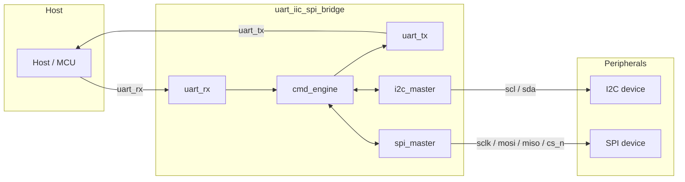

# Architecture

## Block diagram

## Modules

- **`rtl/baud_gen.v`** - free-running divider shared by `uart_rx` and
  `uart_tx`. Produces a 16x-oversample tick (for RX mid-bit sampling) and
  a 1x baud tick (for TX bit timing) from a single counter.

- **`rtl/uart_rx.v`** / **`rtl/uart_tx.v`** - standard 8N1 UART. RX uses
  16x oversampling with a 2-flop input synchronizer and mid-bit sampling
  for noise tolerance; TX shifts a `{stop, data, start}` frame out
  LSB-first on each baud tick.

- **`rtl/i2c_master.v`** - single-master I2C controller exposing four
  primitives to `cmd_engine` (START/repeated-START, STOP, byte WRITE,
  byte READ), each a 4-phase (SCL-low-setup, SCL-low-hold, SCL-high-sample,
  SCL-high-hold) bit-banger driven by a runtime-configurable clock
  divider. SCL/SDA are split into `_out`/`_oe`/`_in` triplets rather than
  a Verilog `inout`, matching how a real open-drain pad is controlled at
  the macro boundary.

- **`rtl/spi_master.v`** - full-duplex SPI controller supporting all four
  (CPOL, CPHA) modes and multiple independently-polarized chip selects.
  `hold_cs` keeps the currently-selected CS asserted across consecutive
  byte transfers so a multi-byte burst appears as one SPI transaction.

- **`rtl/cmd_engine.v`** - the protocol engine: receives a framed command
  byte-by-byte from `uart_rx`, validates its checksum and length, drives
  `i2c_master`/`spi_master` through the requested transaction via a
  small state machine, and sends the framed response back through
  `uart_tx`. Owns the runtime-configurable registers (I2C/SPI clock
  dividers, SPI mode, CS polarity). See `docs/PROTOCOL.md` for the full
  wire format.

- **`rtl/uart_iic_spi_bridge.v`** - the native/standalone top level,
  wiring the modules above to a small, purpose-named pinout (see the
  README for the pin table). This is the macro used by
  `flow/standalone/`.

- **`rtl/tt_um_uart_iic_spi_bridge.v`** - a thin
  [TinyTapeout](https://tinytapeout.com)-shaped wrapper around the same
  core: it only renames/maps signals onto `ui_in`/`uo_out`/`uio_*`, with
  no added logic. Every core port is wired straight to a real top-level
  pin in both variants, so nothing is ever dangling and synthesis has no
  dead logic to optimize away in either flow. Used by `flow/tinytapeout/`.

## Command execution flow (cmd_engine)

`cmd_engine` is a single synchronous state machine built from a few
reusable sub-sequences rather than one state per opcode:

1. **Frame reception** - collects OPCODE, LEN, up to `MAX_PAYLOAD`
   payload bytes, and the checksum byte into local registers.
2. **Validation & dispatch** - checks the checksum and length, then
   either jumps straight to sending an error response or begins
   executing the requested transaction.
3. **I2C execution** - a generic "issue a primitive, wait for `done`"
   pair of states (`ST_I2C_ISSUE` / `ST_I2C_WAIT`) is reused for every
   START/STOP/WRITE/READ call; per-opcode decision states between calls
   figure out what to do next (loop over more bytes, follow a write
   phase with a repeated START and a read phase for `I2C_WRITE_READ`,
   abort to STOP on a NACK, etc).
4. **SPI execution** - a two-state loop (`ST_EX_SPI_ISSUE` /
   `ST_EX_SPI_WAIT`) issues one byte transfer at a time with `hold_cs`
   held until the last byte of the burst.
5. **Response transmission** - a generic "send one byte, wait for
   `uart_tx` to finish" sub-sequence is reused for the STATUS, RLEN,
   each payload byte, and the checksum.

## TinyTapeout pin mapping

| Core signal | TT pin | Direction |
|---|---|---|
| `uart_rx` | `ui_in[0]` | in |
| `spi_miso` | `ui_in[1]` | in |
| *(reserved)* | `ui_in[7:2]` | in |
| `uart_tx` | `uo_out[0]` | out |
| `spi_sclk` | `uo_out[1]` | out |
| `spi_mosi` | `uo_out[2]` | out |
| `spi_cs_n[0]` | `uo_out[3]` | out |
| `spi_cs_n[1]` | `uo_out[4]` | out |
| `busy` | `uo_out[5]` | out |
| `error` | `uo_out[6]` | out |
| heartbeat | `uo_out[7]` | out |
| `i2c_scl` | `uio[0]` | bidir (open-drain via `uio_out`/`uio_oe`/`uio_in`) |
| `i2c_sda` | `uio[1]` | bidir (open-drain via `uio_out`/`uio_oe`/`uio_in`) |
| *(unused)* | `uio[7:2]` | `uio_oe` held low |
